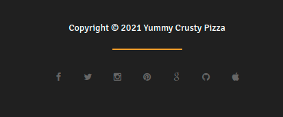
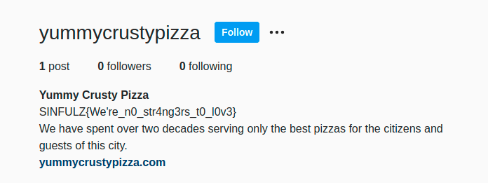
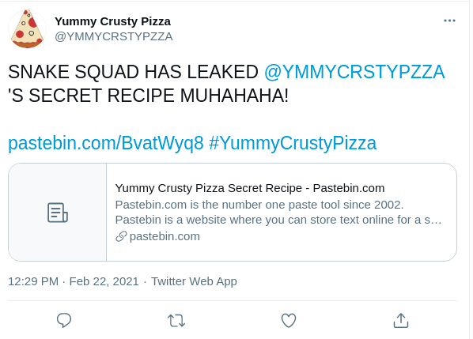
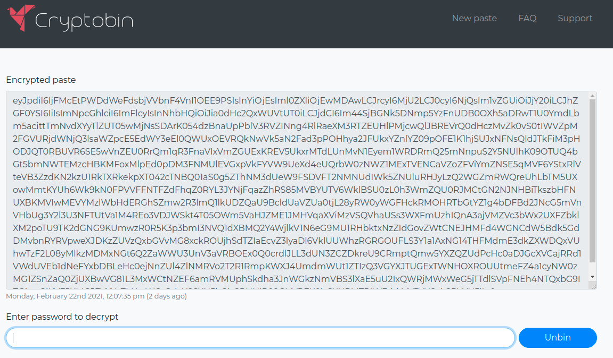
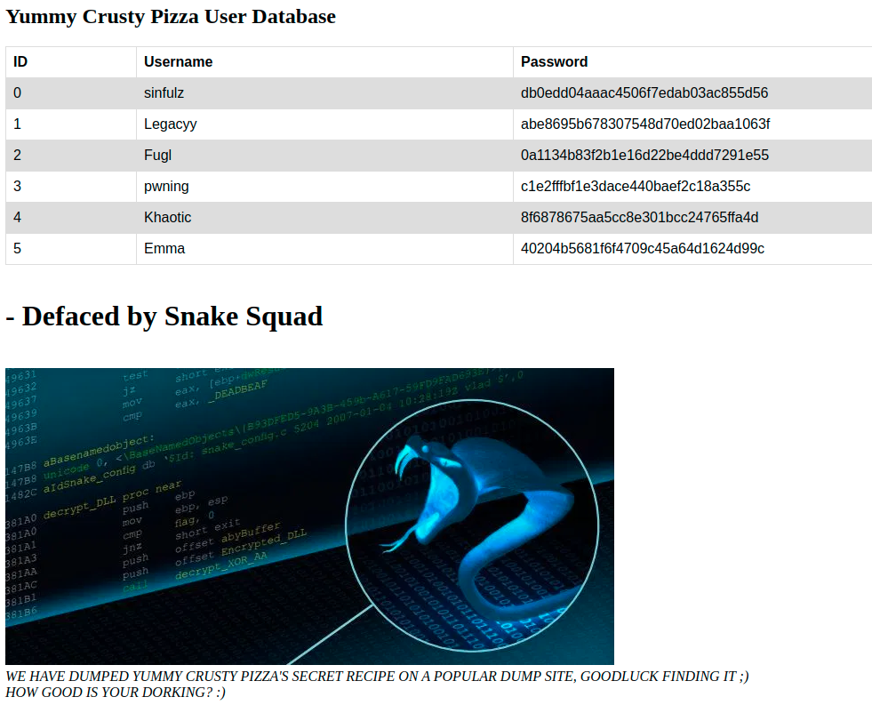
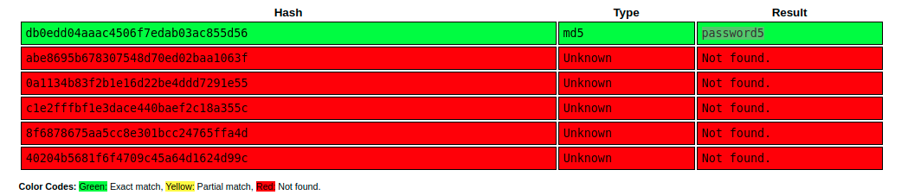

Sinfulz Pizza

# Sinfulz Pizza

**Twitter link:** https://twitter.com/s1nfulz/status/1364529059787534336

## Google Dorking
**Name of company:** Yummy Crusty Pizza
Googele doodle provides:
`"Yummy Crusty Pizza"`
```
Twitter: https://twitter.com/YMMYCRSTYPZZA
Website: https://yummycrustypizza.com/
```
Open both in tabs!!


## Website
**START WITH WEBSITE:** (Tab one)
At the bottom there are a few links: 

[Twitter](https://twitter.com/YMMYCRSTYPZZA), [Insta](https://www.instagram.com/yummycrustypizza/), [Pinterest](https://www.pinterest.com.au/yummycrustypizza/_saved/) and [GitHub](https://github.com/yummycrustypizza) are the only solid links

We know about the twitter page. The other pages are dead ends except Instagram!!

## Instagram
Message with a Flag in it!!!

Can It be that easy?? Check with `sinfulz#4444` on Discord. WELL DONE YOU HAVE FOUND A FAKE FLAG!
Go back to the website:

## Website
There is a menu button for the [database](https://yummycrustypizza.com/database.html)

**Database page...**
```
Dear customers, we were hacked and this sensitive page has been removed from our publicly facing website. We do fear that the page was indexed though. Hopefully no one can OSINT the old page. In the meantime, Google has been contacted to remove any form of indexing from their search engine.
Sorry for any inconvenience caused.
- Crusty Yummy Pizza Team
```

*Have to see if there is cached page!!!*

## Twitter


Ah! a pastebin link
[pastebin link](https://pastebin.com/BvatWyq8)

## Pastbin
It contains a recipe but also a link:
`Unlock our secret recipe at: https://cryptobin.co/j5h5l4y8`

## Cyptobin
As expected there is an encrypted message that requires a password...

**Right that's what we need to get.** 

***
Back to the Website!
## Website
If they removed the page then it may be cached on the Way Back Machine:

[Archived Site](https://web.archive.org/web/20210222081058/https://yummycrustypizza.com/database.html)
**We have a hit!**


Those paswords look like hex but [CyberChef](https://gchq.github.io/CyberChef/#recipe=From_Hex('Auto')&input=ZGIwZWRkMDRhYWFjNDUwNmY3ZWRhYjAzYWM4NTVkNTY) does not agree. 
`Û.Ý.ª¬E.÷í«.¬.]V`
Maybe just hashed??

One Has to love [Crackstation](https://crackstation.net/)


Now, lets see if that is the password for the Cryptobin???

**INDEED**
# FLAG OBTAINED!
